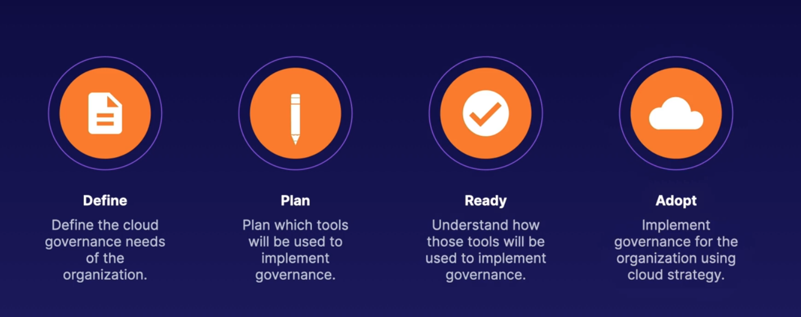
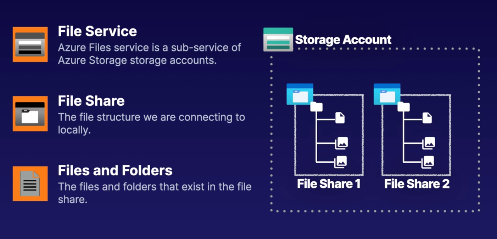
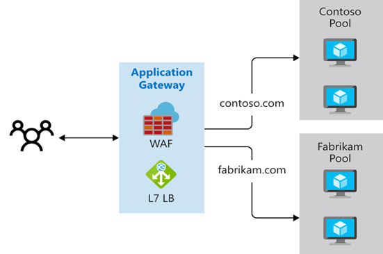

# AZ 104 Notes

## Exam notes

- Exam AZ-104: Microsoft Azure Administrator
- 40-60 questions in 120 min
- A score of 700 is required to pass (70%)
- Exam sections:
  - Manage Azure identities and governance (15—20%)
  - Implement and manage storage (15—20%)
  - Deploy and manage Azure compute resources (20—25%)
  - Configure and manage virtual networking (20—25%)
  - Monitor and maintain Azure resources (10—15%)

## Exam Tips

- Case-study section
- Pace yourself

## Complimentary Courses

- Identity and Access Management for Azure
  - https://acloud.guru/overview/17e4d37f-5a2a-4840-81a7-c2884425c576?_ga=2.190879715.813804500.1625120551-737218096.1597620394
- Azure Storage Deep Dive
  - https://learn.acloud.guru/course/17ee4dc4-6f8e-4411-b0e9-26bdd4b8936c/dashboard

## Azure Administration

- Can use REST API endpoints to manage Azure through ARM (Azure Resource Manager)
- Azure Resource Manager is a management service
- Each resource has a resource provider
- 
- Azure Portal and Cloud Shell
  - Hamburger menu
  - Blades
  - Directory and subscription filter
  - Notifications
  - Support and Troubleshooting
- Azure CLI
  - A command line utility for managing Azure resources
  - Commands
    - $rg = az group list --query [].name -o tsv

    ```bash
        az vm create `
        >> --resource-group $rg `
        >> --name vm-demo-02 `
        >> --image UbuntuLTS `
        >> --admin-username jorgevasquez `
        >> --generate-ssh-keys
    ```

- Azure Powershell
  - A set of cmdlets for managing Azure resources
  - Supports tab autocomplete
  - Commands
    - clear
    - $rg = (Get-AzResourceGroup).ResourceGroupName
    - code linuxvm.json

- ARM Templates
  - IaC
  - Repeatable depployments
  - declarative JSON
  - Components of a template:
    - Parameters and variables to pass information to the template
    - Resources component is used to define resources in the template
    - The outputs component is used to return output from the execution of the template
  - Using Azure CLI:
  
       ```bash
        az deployment group create `
        >> --resource-group (az group list --query [].name -o tsv) `
        >> --name CLIDEPLOY `
        >> --template-file linuxvm.json
        ```

## Governance and Compliance

- Managing Subscriptions
  - Subscription
    - Billing unit that aggregates all costs of underlying resources
    - Contain resource groups and their associated resources
    - Scoping level for governance and security
    - Associated with an Azure AD Tenant
    - An AD Tenant can have a Trust relationship with multiple subscriptions
    - One subscription can only be associated with a single organization (Azure AD Tenant) at a time
    - Types of Subscription
      - Enterprise Agreement
      - Pay as you go
      - Free Trial
      - Enterprise Dev/Test
      - ...etc
    - Subscription Naming conventions
      - Based on environment (Prod/Dev/Staging)
      - Based on Department/Teams
      - Based on Region
- Using Management Groups
  - Allows to organize and manage subscriptions by logically grouping them into management subscriptions
  - This organizational hierarchy can be used to provide scoping for enforcing governance and compliance
  - Supports 6 levels of hierarchy
  - Root management group is the top-level
  - Root management group access is not given by default
  - Global Administrators must be elevated to User Access Administrator of root group in order to manage the Root Management Group (not given by default) 
  - Management groups and subscriptions can have a single parent
  - Have compliance support
    - Azure Policies
    - Azure role-based access control (RBAC) at various scopes
- Azure Policies
  - Allow to enforce compliance and enable auditing
  - Usage Examples:
    - Prohibit Resources
      - Control Costs
      - Restrict Service Access
    - Allowed Locations
      - Geographical compliance
  - Components of an Azure Policy
    - Policy Definition
      - Defines the evaluation criteria for compliance, and defines the actions that take place.  Either audit or deny should something be outside of compliance
    - Policy Assignment
      - The scope at which we will assign our policy.  The scope could be a management group, subscription, resource group or resource
      - You can also attach exclusions as part of the Scope.
    - Initiative Definition
      - A collection of policies that are tailored to achieving a singular high-level goal together.  For example, ensuring that VMs meet standards.
  - Examples:
    - [Allowed locations built-in policy](code_samples/example_built_in_allowed_locations_policy.json)
- Tagging Resources
  - Tags
    - Name value pairs that can be assigned to resource
    - Exs:
      - Dept:marketing
      - Env:Prod
    - Name can be 512 characters, for storage accounts name can only be 128 characters
    - Value can be 256 characters
    - Can be assigned to Resources, Resource Groups, and Subscriptions
    - Children don't inherit tags
    - A resource can have up to 50 tags
    - Sample commands

       ```bash
        az resource list --tag project=az104 --query [].name -o tsv
        az resource list --tag project=az104 --query [].id -o tsv
        foreach ($r in az resource list --tag project=az104 --query [].id -o tsv) {
            echo "Deleting $r"
            az resrouce delete --ids $r
        }
        az tag update `
        >> --resource-id (az vm show --resource-group $rg --name notag-vm --query id -o tsv) `
        >> --operation Replace `
        >> --tags project=az104
        ```

- Locking and Moving Resources
  - What are Locks
    - You can lock an Azure subscription, resource group, or resource to protect them from accidental user deletions and modifications
    - The lock overrides any user permissions.
    - Locks are inherited by children
    - Lock Types
      - Read-only
        - Can be read but not modified or deleted in any way
      - Delete
        - Resources cannot be deleted
        - Give us read and write permissions to modify resource
    - Locks get moved with resources and do not affect the moving process
    - Locks affect resources but not data, ex:  In a storage account you would still be able to delete data inside even if there's a lock
  - Moving resources
    - Resources can be moved between RGs, subscriptions, and regions
    - Dependency resources have to be moved as well (Ex:  NSGs, VNets, Public IP Address, Network Interface, etc)
    - The moving validation takes place automatically when the move is done from within the portal
    - Supported Resources:
      - Virtual Machines
      - Storage Accounts
      - Virtual Networks
    - Unsupported Resources
      - Azure Active Directory Domain Services
      - Azure Backup Vaults
      - Azure App Service Gateways
- Managing Azure Costs
  - What affects cost
    - Subscription Type
      - Free, Pay-as-you-go, Enterprise Agreement, Cloud Solution Provider (CSP), etc.
    - Resource Type
      - Ex:  Storage account blob storage vs table storage
    - Usage Meters
      - Utilities like overall CPU time, ingress/egress network traffic, and disk size
    - Resource Usage
      - The costs of actually using a resource
    - Location
      - The costs for various services vary across geographical regions
  - Best practices
    - Select appropriate resource for use case
    - Understand resource needs (sizing)
    - Deallocate resources when not needed
    - Use cloud capabilities where possible (Scalability, Elasticity)
    - Plan costs prior to purchase
  - Cost Tools
    - Pricing Calculator
      - Estimate workfload costs for prospective workloads
      - Modify workfload details
      - https://azure.microsoft.com/en-ca/pricing/calculator/
    - Total Cost of Ownership (TCO) Calculator
      - Compare costs between on-prem and same workload within Azure cloud
      - https://azure.microsoft.com/en-ca/pricing/tco/calculator/
    - Cost Management
      - budgets and alerting
      - Cost analysis tool to understand where we're spending our money
      - Get estimates of projected cost
- Building a Cloud Governance Strategy
  - Governance:  The manner of controlling and the means and methods by which we control something
  - Means and Methods for Cloud Governance
    - Rules
    - Policies
    - Compliance Standards
  - Planning Cloud Strategy
    - 
  - Governance Services
    - Management Groups and Subscriptions
    - Azure RBAC
    - Azure Policies and Blueprints
    - Locks and Tagging
- Azure Advisor
  - Azure Advisor is a personalized cloud consultant that helps you follow best practices to optimize your Azure deployments. It analyzes your resource configuration and usage telemetry and then recommends solutions that can help you improve the cost-effectiveness, performance, reliability, and security of your Azure resources.
- Resource Groups
  - Resources can only exist in one resource group.
  - Resource Groups cannot be renamed.
  - Resource Groups can have resources of many different types (services).
  - Resource Groups can have resources from many different regions.
  - All the resources in your group should share the same lifecycle. You deploy, update, and delete them together. If one resource, such as a database server, needs to exist on a different deployment cycle it should be in another resource group.
  - A resource can interact with resources in other resource groups. This interaction is common when the two resources are related but don't share the same lifecycle (for example, web apps connecting to a database).

## Identity

- Conceptualizing Azure Active Directory
  - IAM Basics
    - Principal
      - An unauthenticated entity that will seek to authenticate as an identity
    - Identity
      - An identity profile that is authenticated against using credentials
    - Authorizations
      - Actions that are permitted/prohibited for an identity to perform
  - Service Principal Object
    - To access resources that are secured by an Azure AD tenant, the entity that requires access must be represented by a security principal. This requirement is true for both users (user principal) and applications (service principal). The security principal defines the access policy and permissions for the user/application in the Azure AD tenant. This enables core features such as authentication of the user/application during sign-in, and authorization during resource access.
    - There are three types of service principal:
      - Application
        - The type of service principal is the local representation, or application instance, of a global application object in a single tenant or directory. In this case, a service principal is a concrete instance created from the application object and inherits certain properties from that application object.
        - A service principal is created in each tenant where the application is used and references the globally unique app object. 
        - When an application is given permission to access resources in a tenant (upon registration or consent), a service principal object is created.
        - The service principal object defines what the app can actually do in the specific tenant, who can access the app, and what resources the app can access.
      - Managed Identities
        - Managed identities eliminate the need for developers to manage credentials
        - 
        - 2 types:
          - User-assigned managed identities
            - Managed identity as a standalone Azure resource
            - Can be assigned to one or more instances of an Azure service
          - System-assigned managed identities
            - The identity is tied to the lifecycle of that service instance. When the resource is deleted, Azure automatically deletes the identity for you. By design, only that Azure resource can use this identity to request tokens from Azure AD.
      - Legacy
        - This type of service principal represents a legacy app, which is an app created before app registrations were introduced or an app created through legacy experiences. A legacy service principal can have credentials, service principal names, reply URLs, and other properties that an authorized user can edit, but doesn't have an associated app registration.
  - What is Azure Active Directory (Azure AD)
    - Global service that spawn all Azure regions
    - Provides an identity repository
    - Allows to create Identity resources such as Users and Groups
    - Allows to manage Identity Security (Enable MFA Control Resources Access, and provide policy-based controls)
  - Azure AD Tenant Architecture
    - Tenant == Organization == Directory
    - We can get a default domain (ex:  acg.onmicrosoft.com) or get a custom one
    - Trust relationship between subscription and Tenant, 1 subscription can be associated to only 1 Tenant at a time
    - 1 Tenant can have multiple Subscriptions
    - Every new Azure AD tenant comes with an initial domain name, <domainname>.onmicrosoft.com. You can’t change or delete the initial domain name, but you can add your organization’s names.  
      - You can verify your custom domain name by using TXT or MX record types with your domain name registrar.
  - Azure AD Features
    - IAM Platform
    - Identity Security (Ex:  MFA, PIM-Privileged Identity Management)
      - PIM
        - Privileged Identity Management (PIM) is a service in Azure Active Directory (Azure AD) that enables you to manage, control, and monitor access to important resources in your organization.
        - Organizations can give users just-in-time privileged access to Azure and Azure AD resources and can oversee what those users are doing with their privileged access.
        - Features:
          - Provide just-in-time privileged access to resources and directory
          - Assign time-bound access to resources using start/end dates
          - Require approval to activatee privileged roles
          - Enforce Multi-factor Authentication to activate any role
          - Use justification to understand why users activate
          - Get notifications when privileged roles are activated
          - Conduct access reviews to ensure users still need rolees
    - Collaboration and Development (Azure AD B2B or Azure D B2C to invite external users into our Azure AD Tenant)
    - Monitoring (Ex: Audit Logs, security monitoring, identity protection, risk management)
    - Identity Integration (Hybrid Identity and SSO using Azure AD Connect and Azure AD Domain Services)
  - Licensing Options
    - Free
      - Does not let us use Dynamic Groups
    - Office 365
    - Premium P1
    - Premium P2
  - Active Directory vs Azure AD
    - Active Directory
      - Organization Units (OUs)
      - Group Policy Objects (GPOs)
      - Kerberos, LDAP, NTLM
      - Hierarchical
      - On-Premise
    - Azure AD
      - Administrative Units
      - SAML, WS-Federation, OAuth
      - Flat Directory Structure
      - Cloud-based solution
      - Global
- Managing Tenants
  - SSPR:  Self-Service Password Reset
  - 
- Creating and Managing Users
  - Types of Users
    - Administrators
      - Users with an administrator role assigned
    - Members
      - Regular users that are native to Azure AD
    - Guests
      - External users that are invited to the Azure AD Tenant
  - Methods of Creating Users
    - Azure Portal
      - Azure AD service > Select Users > New User
    - Azure CLI
      - az ad user create
    - PowerShell
      - New-AzureADUser
    - Bulk Operations
      - CSV
      - Each operation has a different template file
      - Steps to create users in bulk:
        1. Sign in with acccount that is a User administrator
        2. Select Users..Bulk Create
        3. On the Bulk create user page, select Download to receive a valid comma-separated values (CSV) file of user properties, and then add users you want to create.
        4. Open the CSV file and add a line for each user you want to create. The only required values are Name, User principal name, Initial password and Block sign in (Yes/No). Then save the file.
        5. On the Bulk create user page, under Upload your CSV file, browse to the file. When you select the file and click Submit, validation of the CSV file starts.
- Creating and Managing Groups
  - Groups
    - Simplifies user management and permissions
    - Have Owner and Members
    - Users in a group inherit roles assigned to a group
    - Types of Groups
      - Security Groups
        - Used for controlling access to Azure Subcriptions and Resources within
      - Microsoft 365 Groups
        - Used for permissions within Microsoft 365 (Ex:  access to a shared mailbox, calendar, files, etc.)
    - Membership Type
      - Assigned
      - Dynamic User
        - Ex:  Based on a user property such as `Dept:Human Resources`
      - Dynamic Device
- Creating Administrative Units
  - Act as a container for groups and user objects
  - Give us ability to create a scope where we can contain our users and our groups
  - Helps break the spawn of control
- Configuring SSPR (Self-Service Password Reset)
  - Enables users to reset their own passwords
  - Can be enabled for ALL users, Selected Groups or None
  - Process:  Localization-->Verification-->Authentication-->Password Reset-->Notification
  - All admin users are notified whenever a password is reset for another admin
  - Authentication methods:
    - Mobile App
    - Mobile App Code
    - Email
    - Mobile Phone (using a phone call or SMS, less recommended because SMS can be spoofed)
    - Office Phone
    - Security Questions (can be easily socially engineered)
  - SSPR is supported for all users, including cloud-only users.  You can configure password writeback to update on-premises passwords.  For cloud-only users, passwords are stored in Azure AD.
  - Keep in Mind
    - One or more of the authentication methods is required for SSPR
    - Admins cannot use security questions and must register for MFA methods
    - P1 or P2 Microsoft Apps for Business license or Microsoft 365 licensing required for SSPR
- Azure AD Device Management
  - Options to register devices
    - Azure AD Registered
      - Least restrictive option
      - Allows BYOD with personal Microsoft or local account
      - Supports Windows 10, iOS, iPadOS, Android, macOS
    - Azure AD Joined
      - Device is Owned by organization
      - Accesses AAD through a work account
      - Identities only exist in the cloud
      - Supports Windows 10 and Server 2019
    - Hybrid Azure AD Joined
      - Similar to AAD joined however device identities exist both on-premises and in the cloud
      - Supports Windows 7, 8.1, 10 and server 2008 or later
  - Conditional Access Policies
    - 
    - 
- Configuring Azure AD Join
  - Method of registering devices to our network
  - Management Options:
    - MDM-Only
      - MDM System Support using Microsoft Intune (MDM:  Mobile Device Management)
    - Co-Management
      - Locally installed Configuration Manager and MDM Provider

## Role-Based Access Control

- Understanding Roles in Azure
  - RBAC is an authorization system for providing access based on roles that are asigned to users
  - Components
    - Security Principals
      - The WHO in RBAC
      - Ex:  Users in Azure AD
    - Roles
      - The WHAT in RBAC
      - Role definitions define what actions are allowed
      - Supports both Allow (Actions) and Deny (Not Actions)
      - Separates Control Plane Actions from Data Plane Actions
    - Scope
      - The WHERE in RBAC
      - Where can the actions be performed (Management Groups, Subscriptions, Resources)
  - The binding sauce is the `Role Assignment`
  - 2 types of Roles:
    - Azure Roles
      - aka:  Azure RBAC
      - Permissions have a waterfall effect
      - Built-in roles:
        - Owner
          - Full access to resources and delegated access
        - Reader
          - Can only view resources
        - Contributor
          - Create and Manage resources
        - User Access Administrator
          - Delegate access to resources to other users
      - Manage access to Azure resources
      - Scope can be at multiple levels
      - Supports custom roles
    - Azure AD Roles
      - Manage access to Azure AD resources (Users and Groups)
      - Scope is at tenant level
      - Supports custom roles
      - Built-in roles:
        - Global Administrator
        - User Administrator
        - Billing Administrator
- Assigning Access to Resources
  - 
- Creating Custom Roles
  - Actions are specified with strings that have the following format:
    - `{Company}.{ProviderName}/{resourceType}/{action}`
    - The first parts of the action string are referred to as:  "Resource Providers"
    - In order to create a custom role you need the User Access Administrator or Owner role for the account
    - example:

      ```json
      {
          "Name": "Helpdesk Administrators",
          "Description": "Can Read, Restart VMs, and log support tickets with Microsoft",
          "Actions": [
              "*/read",
              "Microsoft.Compute/virtualMachines/start/action",
              "Microsoft.Support/*"
          ],
          "NotActions": [],
          "DataActions": [],
          "NotDataActions": [],
          "AssignableScopes": [
              "/subscriptions/subscriptionId"
          ]
      }
      ```

## Storage Accounts

- Describing Storage Accounts
  - Sub-services:
    - Azure Queue
      - Message-based storage for microservices
    - Azure Files
      - Cloud-based file sharing service
    - Azure Table
      - Non-relational semi-structured data storage service
    - Azure Blob
      - Object-oriented storage solution
  - Components:
    - Account Type
      - Determines features and costs
    - Performance Tier
      - Determines performance levels
    - Replication
      - Determines infrastructure redundancy
      - Options:
        - LRS (Locally-Redundant Storage):
          - Lowest cost
          - 3 copies
          - 
        - GRS (Geo-redundant-Storage)
          - 
        - ZRS (Zone-redundant storage)
          - 
        - GZRS (Geo-zone-redundant storage) or RA-GZRS (read-access geo-zone-redundant storage)
          - 
      - Switch between Types of Replication
        - Options:
          - Manual
            - You cannot use a manual migration to migrate from ZRS to GZRS or RA-GZRS. You must request a live migration.
          - Live Migration
            - Live migration is not supported for premium block blob or page blob storage accounts.
            - If you need to migrate your storage account from LRS to ZRS in the primary region with no application downtime, you can request a live migration from Microsoft.
            - During a live migration, you can access data in your storage account with no loss of durability or availability.
            - The Azure Storage SLA is maintained during the migration process.
            - There is no data loss associated with a live migration.
            - Service endpoints, access keys, shared access signatures, and other account options remain unchanged after the migration.
          - Use the Azure Portal, powershell, or Azurel CLI to change the replication setting for a storage account
    - Access Tier
      - Determines access levels and data costs
        - Options:
          - Hot (default)
          - Cool
          - Archive
  - Requires unique global name with lower case characters and numbers and 3-24 chars
  - 
- Azure Blob Storage
  - Store items such as:  Image/Video files, Text Files, Log Files
  - Architecture Components
    - Blob Service
      - Sub-service for storage accounts
    - Blob Container
      - Container where we store our blobs
      - Act as our buckets
  - Types of Blobs
    - Block blobs
      - Best suited for Streamin
    - Append Blobs
      - Ex: Log Files
    - Page Blobs
      - Ex: Virtual Machine Disks
  - Container Access Levels:
    - Private (No anonymous access)
    - Blob (Anonymous access to blob)
    - Container (Anonymous access to container and blobs it contains)
- Blob Object Replication
  - Object replication asynchronously (not immediatele) copies block blobs and  their versions, between a source storage account, and a destination account.
  - Only GPv2 standard supports object replication of block blobs and their versions
  - Object replication is supported across subscriptions and Azure AD tenants
  - Versioning must be enabled on both the source and destination accounts to perform replication
  - Change feed must be enabled on the source account since Azure storage monitors the $blobchangefeed to advise replication
  - A storage account can be a source for up to destination accounts.  Each policy supports only a single pairing using a Policy Id. (therefore for 2 destinations 2 different policies are required)
- Blob Lifecycle Management
  - A feature of the blob service that enables automation to manage the lifecycle of blobs, my moving blobs between access tiers, to optimize storage costs
  - Supports GPv2 storage accounts, Blob storage accounts, and BlockBlob storage accounts
  - Uses if/then logic in lifecycle rules to move blobs through access tiers based on modification and access times
  - Scoping at the storage account-level or limit blobs with filters
  - Supports block and append blobs, and supports subtypes such as:  base blobs, snapshots, and versions. (page blobs are not supported)
  - Filtering blobs in the rule using prefix or blob index matches.
  - A lifecycle management policy is comprised of one or more rules that define a set of actions to take based on a condition being met.
- Azure File shares
  - Azure files is a managed file share service
  - Sub-service/sub-resource of Azure storage accounts
  - Can be mapped to on-prem or vms or other compute resources inside of Azure
  - Features:
    - SMB (Server Message Block protocol) Connectivity
    - Supports Windows, Linux, and macOS
    - Extended by Azure File Sync
    - Traditional File Structure
  - Components:
    - 
  - Connectivity Options:
    - Internal Connectivity
      - REST
      - SMB
        - 2.1 (Doesn't provide encryption)
        - 3.0
    - External Connectivity
      - REST
      - SMB
        - 3.0
  - Security
    - Data encrypted at rest by default and in transit over https
  - Tiers (determine price and performance)
    - premium (only available for premium file storage accounts)
    - transaction optimized
    - hot
    - cool
  - File Share Quota up to 100TB (default of 5TB)
- Azure File Sync
  - Is an extension of Azure Files that allows you to extend the capabilities of on-premise file servers
  - Features:
    - Locally cache frequently accessed files
    - Requires Windows 2012 R2 or later
    - SMB, NFS, and FTPS
    - Requires File Sync agent
  - Components:
    - Storage Sync Service (High level Azure resource)
      - Needs to be in same region as Storage Account
    - Cloud Endpoint (Azure File share utilized in File Sync)
    - Registered Servers (Trusted on-premises file servers)
      - Server Endpoint (from registered server)
      - Cloud Endpoint (from Azure File Share)
    - Sync Group
      - A sync group defines the sync topology for a set of files. Endpoints within a sync group are kept in sync with each other. A sync group must contain one cloud endpoint, which represents an Azure file share, and one or more server endpoints.
      - multiple server endpoints can exist on the same volume if their namespaces are not overlapping (for example, F:\sync1 and F:\sync2) and each endpoint is syncing to a unique sync group meaning you can not have more than one server endpoint from the same server in the same sync group.
      - Components:
        - File Share
        - Server Endpoint
          - A server endpoint represents a specific location on a registered server, such as a folder on a server volume.
        - Cloud Endpoint
          - A cloud endpoint is a pointer to an Azure file share. All server endpoints will sync with a cloud endpoint, making the cloud endpoint the hub.
  - Creation steps:
    1. Prepare Windows Server to use with Azure File Sync
       - For each server that you intend to use with Azure File Sync, including each server node in a Failover Cluster, disable Internet Explorer Enhanced Security Configuration.
    2. Deploy the Storage Sync Service
       - Storage Sync Services...Create Azure File Sync (Name, region, Networking whether to allow access from all networks or only private endpoints)
    3. Install the Azure File Sync agent and Register your servers with Storage Sync Service (Download the Azure File Sync Agent and register them with the Storage Sync Service)
       1. Create a new Volume on the data disk of the Windows Server
       2. Install-Module -Name Az
       3. Download and Install Azure File Sync Agent
          1. Sign into Azure a Chooser a Storage Sync Service
          2. Register server with previous Storage Sync Service
       4. Create Endpoint from new Volume
    4. Create a Sync Group and a Cloud Endpoint
       1. Select Storage Account with Sync Share
       2. The Sync Group will contain a cloud endpoint and a server endpoint
- Storage Network Access
  - Storage Access Options
    - Public Endpoint
      - All services are public by default using the service's public endpoint URL
      - syntax of URL:  https://<accountName>.<subService>.core.windows.net/<resourceName>
    - Restricted Access
      - Storage account access can be restricted to virtual networks, IP address ranges via the storage account's firewall, and via specific resource instances
    - Private endpoints
      - Allow private IP access for resources in an associated virtual network
- Securing Storage Accounts
  - By default, all data stored (data at rest) in any Azure Storage service is secured using Storage Service Encryption (SSE)
  - All data in transit can be secured using transport-level security (https)
  - Azure Storage Authentication
    - 2 different layers of access control
      - Management Layer (Control Plane)
      - Data Layer (Data Plane)
    - Access keys
      - Azure-generated keys that provide unlimited access to both the management and data layer of an Azure Storage solution
    - Shared Access Signature (SAS)
      - An access signature, generated from access keys, that provides limited access at either the account level or the service level
      - When you use a shared access signature, you have two different options. You can either use an ad-hoc shared access signature or configure a stored access policy. By using an ad-hoc shared access signature, you specify the start time, expiration time, and permissions in the Uniform Resource Identifier (URI). If someone copies this URI, they will have the same level of access as the corresponding user. This means that this type of shared access signature can be used by anyone in the world. By configuring a stored access policy, you define the start time, expiration time, and permissions in the policy and then associate a shared access signature with that policy. You can associate more than one shared access signature with the same policy.
      - When you set the start time of a shared access signature to now, there can be slight differences in the clocks of the servers that host the storage account. These differences could lead to an access problem for a few minutes after the configuration. If you need your shared access signature to be available as soon as possible, you should set the start time to 15 minutes before the current time, or you can just not set the start time. Not setting the start time parameter means that the shared access signature will be active immediately.
      - You can revoke a shared access signature by deleting a stored access policy. If you associate a shared access signature with a stored access policy, the start time, expiration time, and permissions are inherited from the policy. If you remove the policy, you are invalidating the shared access signature, thus making it unusable. Keep in mind that if you remove a stored access policy with an associated shared access signature and then create another stored access policy with the exact same name as the original policy, the associated shared access signature will be enabled again.
      - Validate data written using a SAS. When a client application writes data to your storage account, keep in mind that there can be problems with that data. If you plan to validate data, perform that validation after the data is written and before it is used by your application. This practice also protects against corrupt or malicious data being written to your account, either by a user who properly acquired the SAS, or by a user exploiting a leaked SAS.
    - Azure AD Authentication
      - Uses Azure role-based access control (RBAC) and Azure Active Directory (AD) identities to provide authentication (instead of access keys)
- Using Azure Jobs
  - Move large amounts of data between on-premises and Azure storage (whenever network bandwidth doesn't support the amount of data that we're trying to move)
  - Options:
    - Move to/from Blob service
    - Move to Files service
    - Transport self-supplied drive
      - Supported drive types
        - SATA
        - HDD
        - SSD
  - Azure Import Job (With both Blobs and Files)
    1. Prepare Disks (WAImportExport)
    2. Create Job
    3. Ship Drives
    4. Check job status
    5. Receive disks
    6. Check data in Azure Storage
  - Azure Export Job (only with Blobs)
    1. Create job
    2. Ship drives (WAImportExport)
    3. Check job status
    4. Receive and unlock disks
  - Appears under Import/Export jobs option in the Azure portal
  - Import/Export tool is only supported on Windows devices
  - WAImportExportCLI Tool
    - Used to prepare disks for data and to estimate number of disks needed
- Storage Utilities
  - Storage Explorer
    - A Graphical User Interface (GUI) tool for working with storage accounts.  Supported for Windows, Linux, and MacOS
  - AzCopy
    - A Command-line utility for working with storage accounts.  Supported for Windows, Linux, and MacOS
    - Has scripting capabilities
    - You can provide authorization credentials by using Azure Active Directory (AD), or by using a Shared Access Signature (SAS) token.
    - 

## Virtual Networking

- Conceptualizing Virtual Networks
  - VNets are isolated networks on the Azure Cloud
  - Provide private connectivity between resources like VMs or App Service
  - Allows connectivity between VNets, on-prem networks, and remote user devices
  - Components of a Virtual Network:
    - Address Space
      - The private address space for the isolated network.  Required to provide resources with private IPs.
    - Vnet
      - The isolated network on AUre cloud where resources like VMs are deployed
    - Subnet
      - The segmentation of the isolated network into smaller sub-networks where resources will exist
- Creating Virtual Networks
  - Designing a Network
    - Determine IP CIDR (Can be as large as /8 and as small as /29)
    - Subnetting requirements
      - Determine how to segment the solution to meet your needs
    - Connectivity Needs
      - Determine what kind of connectivity is needed:  Internet, resource to resource, resource to service, etc.
  - VNet Features
    - Subnetting
      - Reserved IP addresses are:  x.x.x.0-3 and x.x.x.255 (5 in total)
    - Private Networking
      - Support for DHCP (Server built-in VNet) for private IP addressing for resources
    - Public Networking
      - Azure VNet supports public IP addressing (IPv4 and IPv6) so that resources can have public connectivity
    - Peering
      - Peering between Azure VNets
    - Network Gateway
      - Azure VNet uses gateway subnets to make VPN connections
    - Monitoring
      - View logs, monitor connectivity, and view a topology of the virtual network
  - Additional Notes:
    - By default, intra-network traffic and outbound internet traffic is allowed
    - Azure-provided DNS or custom DNS options.
    - IP addresses can be changed from dynamic to static.
    - Supported protocols:
      - TCP
      - UDP
      - ICMP
- Deploying Network Resources
  - Types of IPs
    - Private IPs
      - Statically or dynamically assigned addresses that allow private connectivity between resources
    - Public IPs (PIP)
      - Statically or dynamically assigned addresses that allow public connectivity from the internet to a resource
      - SKUs:
        - Basic SKU
          - Statically or dynamically assignable PIP that is accessible by default and requires an NSG to restrict traffic
          - Does not support availability zone deployments
          - Unsecured by default and allow traffic
        - Standard SKU
          - Statically assignable PIP that is not accessible by default and requires an NSG to allow traffic.
          - Supports availability zone deployments
          - Secured by default
          - Allows more options:
            - Routing Preference
              - Microsoft Network
              - Internet
            - Tier
              - Regional
              - Global
            - Availability Zone
              - Include Zone-redundant option
          - The standard SKU is required if you associate the address to a Standard load balancer.
  - NIC IP Configurations
    - Network Interface Card (NIC)
      - IP COnfigurations
        - Private IP
        - Public IP (Optional)
- Routing Virtual Networks
  - Routes=Paths for Connectivity (Routes are paths through which traffic can flow)
  - Each route table can be associated to multiple subnets, but a subnet can only be associated to a single route table.
  - Examples:
    - A route allowing virtual machines to communicate with the internet outbound
  - Routing Types
    - System Routes
      - Default routes built-in to virtual networks that cannot be modified but can ve overriden
      - Network traffic in Azure is automatically routed across Azure subnets, virtual networks, and on-premises networks. This routing is controlled by system routes, which are assigned by default to each subnet in a virtual network.
    - Custom Routes
      - User-defined routes or border gateway protocol (BGP) routes that override system routes
        - BGP is used to exchange routes between Azure and on-premises networks.
        - BGP is the standard routing protocol that is normally used to exchange routing and information among two or more networks.
        - You'll typically use BGP to advertise on-premises routes to Azure when you're connected to an Azure datacenter through Azure ExpressRoute. You can also configure BGP if you connect to an Azure virtual network by using a VPN site-to-site connection.
      - User-defined routes
        - Routes created by users that take precedence over all routes
        - Ex:
          - Overriding routes to the internet to either go to nothing or go to a network virtual appliance (NVA) like Azure Firewall
      - BGP routes
        - Routes that are exchanged between integrated networks
        - Ex:
          - hybrid networks or VNet peering scenarios
  - The Resource Type in Azure is called:  "Route Tables"
    - you creaate the route table and then associate the different routes to it
    - you then can associate multiple subnets to a route table
    - 0.0.0.0/0 is a wildcard to represent any possible IP address
  - Route precedence:  Custom > BGP > System (Therefore Custom routes override every other route)
  - Route Selection and priority
    - If multiple routes are available in a route table, Azure uses the route with the longest prefix match. For example, if a message gets sent to the IP address 10.0.0.2, but two routes are available with the 10.0.0.0/16 and 10.0.0.0/24 prefixes, Azure selects the route with the 10.0.0.0/24 prefix because it's more specific.
    - The longer the route prefix, the shorter the list of IP addresses available through that prefix. When you use longer prefixes, the routing algorithm can select the intended address more quickly.
  - Valid Next Hop types when creating a user-defined route:
    - Internet
    - Virtual Appliance
    - Virtual Network Gateway
    - Virtual Network
    - None
- Network Security Groups (NSG)
  - An NSG controls the traffic flowing through a virtual network.  This is done so by:
    - Creating rules that define what is allowed/denied
    - Controlling Security at the subnet or NIC Network layers
  - Defining NSGs
    - Filter traffic
      - Determining what traffic will be allowed or denied inbound and outbound
    - Rules
      - Evaluating default rules that cannot be deleted and user-defined rules that can be created
    - Priority
      - Specifying priority to order the precedence of rules.  The lower the number, the higher the priority
      - Priority numbers from 100-4096 for user-defined security rules
  - An NSG has no effect unless associaated to either a subnet or network interface card (NIC)
  - Once a rule is matched, no other rule is read
  - NSGs are stateful, meaning that if inbound traffic is allowed outbound traffic is automatically allowed on the ephemeral ports and vice-versa
  - Propertis of NSGs:
    - Priority
    - Port
      - Can be separated by comma
    - Protocol
    - Source
    - Destination
      - Any
      - IP addresses  
      - Service Tag
        - A service tag represents a group of IP address prefixes from a given Azure service. It helps to minimize the complexity of frequent updates on network security rules.
      - Application Security Group
        - Application security groups enable you to configure network security as a natural extension of an application's structure, allowing you to group virtual machines and define network security policies based on those groups.
    - Action (Deny/Allow)
  - Rule execution order:
    - For inbound traffic, Azure processes the rules in a network security group associated to a subnet first, if there's one, and then the rules in a network security group associated to the network interface, if there's one. This includes intra-subnet traffic as well.
    - For outbound traffic, Azure processes the rules in a network security group associated to a network interface first, if there's one, and then the rules in a network security group associated to the subnet, if there's one. This includes intra-subnet traffic as well.
  - The recommended method to manage network security through NSGs is to use NSGs assigned at the subnet level whenever possible. NSGs should be assigned directly to VMs only as necessary to handle exceptions. You cannot assign an NSG to a VNet.
  - Application Security Group
    - Separate service that acts as a container of VMs
    - To associate VMs you have to select the VM and then go to networking...Select tab: Configure the application security groups
    - When creating the rule you can use the ASG as either the destination or source
    - Any NICs that are assigned to an ASG must exist on the same virtual network (VNET) to which the first network interface was assigned.
    - All network interfaces for both the source and destination application security groups need to exist in the same virtual network.
  - Each subnet can have zero, or one, associated network security groups.
  - Each network interface that exists in a subnet can have zero, or one, associated network security groups.
- Azure DNS
  - A Domain Name System (DNS) hosting service that provides name resolution
  - Implemented Using:
    - Records/record sets
    - Supports A, AAAA, CNAME, TXT, MX, PTR, SRV, and SOA
    - private/public zones
  - Alias Records:
    - Name, Type=A, Value=Azure resource names (in case IP addresses change)
    - Azure alias records enable a zone apex domain to reference other Azure resources from the DNS zone.
    - An alias record allows you to link the zone apex (wideworldimports.com) to a load balancer. It creates a link to the Azure resource, rather than a direct IP-based connection. So, if the IP address of your load balancer changes, the zone apex record continues to work.
    - Even though we're creating an alias, the base record type must still be either A, AAAA, or CNAME.
    - Alias record set must be "Yes"
  - The apex domain is the highest level of your domain. In our case, that's wideworldimports.com. The apex domain is also sometimes referred to as the zone apex or root apex. It's often represented by the @ symbol in your DNS zone records.
  - Private DNS Zone
    - Virtual Network Link
      - To link the private DNS zone to a virtual network, you create a virtual network link.
    - Enable auto registration
      - Auto-registers DNS records for VMs in the Linked Virtual Networks
  - Types of Records
    - NS
      - NS stands for 'nameserver,' and the nameserver record indicates which DNS server is authoritative for that domain
      - NS Records are primarily used if you want to break your domain into subdomains. Subdomains indicate you are delegating a portion of a domain name to a different group of name servers, thus creating NS records to point the name of the subdomain to different name servers.
    - SOA
      - The DNS ‘start of authority’ (SOA) record stores important information about a domain or zone such as the email address of the administrator, when the domain was last updated, and how long the server should wait between refreshes.
      - All DNS zones need an SOA record in order to conform to IETF standards.
      - The SOA record is created automatically for the top-level zone and is deleted if the zone is deleted.
- Azure Firewall
  - Platform as a service firewall
  - Fully qualified domain name (FQDN) support
  - Requires Azure Firewall subnet (/26 or lower)
    - Uses this subnet to scale the firewall IPs as needed
  - Features:
    - DNAT and SNAT
      - Configure outbound/inbound NAT rules for your networks
      - SNAT:  Source NAT
        - Source NAT is used when an internal user starts a connection with an external Host.
      - DNAT:  Destination NAT
        - Used when an external Host with a Public IP, starts a connection towards our Internal/Private Network.
    - Network Rules
      - Configure network (Layer 4) rules for what traffic is allowed
    - App Rules
      - Configure rules for filter websites visited from your network
    - Threat Intel
      - Identify malicious IPs and domains
    - Monitoring
      - Integrate with Azure Monitor to capture firewall traffic
  - There needs to be a route table to match all traffic and route it to the firewall
    - The next hop type should be virtual appliance and under address you should add the private IP of the firewall
    - The route table should be associated to the subnet
  - Exercise Scenario:
    - Help a company create a firewall, connect it to the network and meet these requirements to restrict traffic to our server
      - Requirements:
        - Allow RDP traffic to our server through the firewall
        - Users can only access www.microsoft.com from the server
        - Allow port 53 out only for 8.8.8.8, 8.8.4.4 (Google DNS Servers)
      - Steps:
        - Create a firewall
        - Create a route table and associate it to subnet
        - Configure Firewall and test connectivity
      - Notes:
        - In creating a firewall a public IP is required, for firewall management you can use Firewall rules (classic)
        - Nat Collection attributes:
          - Protocol: TCP
          - Source Type:  IP address
          - Destination Address:  Public IP of Firewall
          - Destination Ports:  3389
          - Translated Address:  Private IP of VM
          - Translated Port:  3389
        - Network Collection attributes
          - Protocol: UPD
          - Source Type:  IP address
          - Source:  The IPv4 of the default subnet
          - Destination Type:  IP address
          - Destination Address:  8.8.8.8, 8.8.4.4
          - Translated Port:  53
        - Network Collection attributes
          - Source Type:  IP address
          - Source:  The IPv4 of the default subnet
          - Protocol:  http,https
          - Destination Address:  8.8.8.8, 8.8.4.4
          - Target FQDNs: www.microsoft.com
        - Testing:
          - nslookup -type=TXT test.dns.google.com. dns.google.
- Service Endpoints
  - A virtual network service endpoint provides the identity of your virtual network to the Azure service. Once service endpoints are enabled in your virtual network, you can secure Azure service resources to your virtual network by adding a virtual network rule to the resources.
  - Today, Azure service traffic from a virtual network uses public IP addresses as source IP addresses. With service endpoints, service traffic switches to use virtual network private addresses as the source IP addresses when accessing the Azure service from a virtual network.
  - 
  - Considerations:
    - Used to access PAAS Services such as Microsoft Storage Accounts
    - Equivalent to interface endpoints and gateway endpoints in AWS (VPC Endpoints)
    - By default, Microsoft services have a public endpoint
    - Using service endpoints, you can provide private connectivity to a service from inside your virtual network
    - Has to be enabled per subnet
    - Not all services are supported
    - Supported services differ per region
    - Does not give services a private IP
    - Provides source IP as private IP
  - Service Endpoint Policies
    - Select the specific resources that are going to be supported by the Service Endpoint with this Policy
    - Has to be created independently as a service endpoint policy and then associated to each subnet
  - Advantages
    - Decrease attack surface
    - Enables use of NSG rules
  - Under the hood the routes of the NICs are augmented with the new service endpoint access routes
- Private Endpoints (Private Link)
  - Private IP that acts as an IP for our connected Azure services usch as Storage Account Files
  - 
  - Private endpoints are creating using Azure private link
  - The private endpoint has a NIC attached to it
  - We can also use private links to provide connectivity to customer/partner services

## Intersite Connectivity

- VNet Peering
  - Characteristics:
    - Allows to bridge together virtual networks to allow connectivity between these networks
    - Non-reciprocal
      - Connection has to be established on both sides
    - Global connectivity
      - Peerings can be same region or cross-region (global)
    - Non-transitive
    - CIDR ranges cannot overlap between VNets
  - Benefits:
    - Low-latency, high-bandwidth connections
    - Cross-network communications
    - Data transfer between/across:
      - Subscriptions
      - AAD tenants via Azure roles
      - Azure regions
  - You pay for egress and ingress between VNETs, if it is global between different regions I pay a bit more
  - Using gateway transit, you can enable on-premises connectivity without deploying virtual network gateways to all your virtual networks. This method can reduce the overall cost and complexity of your network. By using virtual network peering with gateway transit, you can configure a single virtual network as a hub network. Connect this hub network to your on-premises datacenter and share its virtual network gateway with peers.
  - Hub and Spoke
    - Ex:  For V1 and V3 to connect to each other via Hub V2 the following is required:
      - Configure the peering connection in the hub only (v2) to allow gateway transit.
      - Configure the peering connection in each spoke (V1 and V3) to use remote gateways
      - Configure all peering connections to allow forwarded traffic
- VPNs
  - VPN Gateway
    - Establishes connectivity between VNets, similar to VNet peering
    - Components
      - VNet gateway for VPN gateway
      - Gateway subnet
        - Recommendation is /27
      - Public IP per VNET gateway
      - IPsect tunnel for encryption
      - Virtual Network Gateway and Local Network Gateway
      - Shared key (PSK). In this field, enter a shared key for your connection. You can generate or create this key yourself.
    - VPN Gateways provide a limited bandwidth connection and is useful in scenarios where encryption is needed, but bandwidth restrictions are tolerable.
    - Capabilities
      - P2S and S2S capabilities
      - Transitive traffic support
      - 
      - 
        - Route-based is more advanced
        - Route-based is also selected when you coexist with an ExpressRoute gateway or if you need to use IKEv2. Policy-based gateways support only IKEv1.
        - A Point-to-Site (P2S) connection requires a Route-based VPN type.
      - 
    - Active/Active vs Active/Passive
      - Existing VPN IPSec Tunnel between Vnet Gateway and Local Network Gateway on Prem can have 2 active or 1 active and 1 passive
      - 
    - Local Network Gateway
      - Specific object that represents your on-premises location (the site) for routing purposes.
      - Requires the IP address of FQDN of the on-premises VPN device to which you'll create a connection
      - Requires one or more IP address ranges (in CIDR notation) that define your local network's address space.
    - Connectivity Options
      - VNet-to-Vnet
      - Site-to-Site
      - Point-to-Site
        - As part of the Point-to-Site configuration, you install a certificate and a VPN client configuration package which are contained in a zip file. Configuration files provide the settings required for a native Windows, Mac IKEv2 VPN, or Linux clients to connect to a virtual network over Point-to-Site connections that use native Azure certificate authentication and are specific to the VPN configuration for the virtual network.
        - Whenever there is a change in the topology of your network, you will always need to download and re-install the VPN configuration file.
      - IPSec tunnel for encryption
    - You can create a site-to-site VPN connection by deploying the following in order:
      1. Deploy a virtual network
      2. Deploy a gateway subnet
         - All gateway subnets must be named ‘GatewaySubnet’ to work properly
         - It is recommended that you create a gateway subnet that uses a /27 or /28.
      3. Deploy a VPN Gateway
      4. Deploy a local network gateway
         - The local network gateway is a specific object that represents your on-premises location (the site) for routing purposes.
      5. Deploy a VPN connection
         - A VPN connection creates the link for the VPN gateway and local network gateway. It also gives you the status of your site-to-site connection.
    - Lab
      - Lab Diagram:
        - 
      - Helper commands
        - ping -c3 172.16.0.4 (Pinging IP address 172.16.0.4 3 times)
        - hostname -I (Get IP address)
      - Create Virtual Network Gateway resource
        - Gateway Type:  VPN, ExpressRoute
        - VPN Type: Route-based, Policy-based
        - SKU:  Basic, VpnGw1, ...,VpnGw5, ..., VpnGw1AZ, ..., VpnGw5AZ
        - Subnet Address range:  Ex:  10.0.1.0/27
        - Public IP Address
        - Enable Active-Active
        - Configure BGP
      - Create Local Network Gateway pointing to VPN Device
      - Configure the VPN Device
      - Create the VPN Connection
    - Terms
      - IKE
        - Internet Key Exchange version 2 (IKEv2) is an IPsec based tunneling protocol that provides a secure VPN communication channel between peer VPN devices and defines negotiation and authentication for IPsec security associations (SAs) in a protected manner.
- Express Route
  - Allows connectivity to both Azure and Microsoft (Ex:  Office 365) Resources using dedicated physical connection
  - Has built-in redundancy with primary and secondary coonnection
  - 
  - Implementation Steps:
    1. Create ExpressRoute Circuit
       - Specify Provider (ISP), Peering Location, Bandwidth, SKU (local, Standard, Premium), Billing Model, etc.
       - All inbound towards Microsoft is free, you pay for outbound from Microsoft towards on-prem
       - Connectivity via private peering
       - dynamic routing via BPG
       - 50 Mbps - 10 Gbps
       - Not encrypted by default
    2. Give Service key to Provider selected for express route
    3. Create Peering Configuration(s)
       - This step will be part of step 2 if the provider only offers Layer 3 connectivity instead of Layer 2
    4. Create Virtual Network Gateway
       - The Gateway type must be ExpressRoute (the other supported type is VPN) and it must be deployed into a gateway subnet
- Virtual WAN
  - Azure Virtual WAN is a networking service that provides optimized and automated branch connectivity to, and through, Azure. Azure regions serve as hubs that you can choose to connect your branches to. You use the Azure backbone to connect branches and enjoy branch-to-VNet connectivity.
  - The cloud hosted network 'hub' enables transitive connectivity between endpoints that may be distributed across different types of 'spokes'.
  - 
  - Networking service that allows a Single Operational Interface to be able to manage a hub-and-spoke style network
  - Manage connections, topologies, firewalls, etc...through same interface
  - Mesh network style
  - SKUs
    - Basic
      - Transitive peering not supported
      - S2S VPN Connections only
      - Upgrade to Standard Supported
    - Standard
      - Transitive peering supported
      - S2S VPN, P2S VPN, ExpressRoute, and VNet-VNet connections
  - Implementation Steps:
    1. Create WAN
    2. Create required Hubs inside WAN (One per region)
    3. Connect VPNs, VNet Connections, or Express Routes within each Hub

## Azure Virtual Machines

- Creating and Managing Virtual Machines
  - What is an Azure VM
    - Scalable cloud computing resource offered as Infrastructure as a Service (IaaS)
    - Includes: CPU, memory, storage, and networking resrouces
  - Core parts
    - CPU and Memory
      - Determined by virtual machine sizing, selected based on VM use case
    - Networking
      - Virtual Networks (VNets), subnets, Network Interface Cards (NIC), Public IP (PIP), Network Security Groups (NSG)
    - Storage
      - Azure Disks, consisting of OS disk, temporary disk and data disk
  - 
    - HPC:  High-performance Compute
    - Naming Convention:  `[Family] + [Sub-family]* + [# of vCPUs] + [Additive Features] + [Accelerator Type]* + [Version]`
  - 
  - VM Properties
    - Name
    - Region
    - Size
    - Image (Linux/Windows)
  - VMs can get initialized using custom [cloud-init](https://cloudinit.readthedocs.io/en/latest/index.html) scripts
  - The VNet of a VM cannot be changed after it is created.
  - If you remove a Azure VM, the component dependencies, that is data disks, the os disk, the virtual network interfaces, and diagnostic containers, will remain in the resource group. These items won't be automatically deleted along with your OS disc.
- Virtual Machine Disks
  - Virtual Hard Disks (VHDs)
    - A file representation of what is found on a hard disk
    - VMs use VHDs to store OS, apps, and data
    - VHDs utilize the underlying Microsoft storage infrastructure
    - They are stored as page blobs in the blob service
  - Disk Encryption at Rest for Defense in Depth
    - Storage Service Encryption (SSE)
      - Encryption of physical disks in the data center
      - Built into Azure platform
    - Azure Disk Encryption (ADE)
      - Optional encryption of the VHDs
      - Ensures a disk is only accessible by the VM that owns the disk
      - OS tools like BitLocker and DM-Crypt
  - Managed vs Unmanaged Disks
    - 
  - Major disk types
    - 
  - VM disks
    - 
    - Most VMs contain a temporary disk, which is not a managed disk. The temporary disk provides short-term storage for applications and processes and is intended to only store data such as page or swap files. Data on the temporary disk may be lost during a maintenance event or when you redeploy a VM.
    - On Azure Linux VMs, the temporary disk is typically /dev/sdb and on Windows VMs the temporary disk is D: by default. The temporary disk is not encrypted by server-side encryption unless you enable encryption at host.
- Virtual Machine Availability and Scale Sets
  - In Azure, there are two options for managing availability and resiliency for your applications. The first option is availability sets. It is used to protect applications from hardware failures within an Azure data center. Meanwhile, availability zones are used to protect applications against Azure data center failures. Take note that an availability set only protects your resources from planned and unplanned maintenance. It cannot protect your applications from data center outages. Also, in the availability set, if a hardware or software failure happens, only a subset of your VMs are impacted and your overall solution stays operational.
  - Availability Sets
    - Allows protection against underlying hardware within an AZ
    - Purpose
      - Protect redundant VMs
      - Protect against underlying host failures
    - Fault Domain (FD)
      - Protect against underlying host failure, such as power or network outages
      - Max: 3
    - Update Domain (UD)
      - Logical grouping of infrastructure for maintenance/updates
      - Max: 20
    - If you want more than 1 Update Domain then Fault Domain has to be > 1
    - Implementation
      1. Create availability set resource
      2. In order to put a VM inside of an Availability Set it must be done upon creation, to add an existing VM you'll have to delete it and recreate it to put into an Availability Set
    - There is one type of modification to global scale set properties that does not follow the upgrade policy. Changes to the scale set OS and Data disk Profile (such as admin username and password) can only be changed in API version 2017-12-01 or later. These changes only apply to VMs created after the change in the scale set model. To bring existing VMs up-to-date, you must do a "reimage" of each existing VM. You can do this reimage via:  `Set-AzVmssVM`
  - Proximity Placement Group
    - Logical grouping used to make sure that Azure compute resources are physically located close to each other
    - Useful for workloads where low latency is a requirement.
  - Scale Sets
    - Purpose
      - Simplify scaling configurations
      - Save costs by aligning usage with demand
      - Scale to demand of traffic
    - Components:
      - VM Definition (Region, Image, Size, Name, NIC, Storage)
      - Scaling Definition (Conditions+Action)
        - Ex:  Condition=CPU 75%, Action=+1VM
        - Allows scaling in/out
    - Orchestration
      - Orchestration Mode
        - Flexible
          - Achieve high availability at scale with identical or multiple virtual machine types
        - Uniform
          - Optimized for large scale stateless workloads with identical instances

  - Lab nginx + cloud init
    - Commands
      - ssh <USERNAME@IP_ADDRESS>
      - hostname
      - nginx -v 
      - sudo systemctl status nginx
    - cloud-init:

      ```yaml
        #cloud-config
        packages_upgrade: true
        packages:
          - nginx
      ```

- Managing Virtual Machine Updates
  - Update Management
    - Manages system updates and patches for workloads both in the Azure cloud and on-premises
    - Supports Linux and Windows VMs
    - Provides capabilities for:
      - Scheduling
      - Compliance scanning
      - Reporting
    - Components 
      - 
      - Microsoft Monitoring Agent is installed in the VM as an extension
      - Automation Account
        - Service for managing update configurations for VMs
      - Hybrid Runbook Worker
        - Runbook for updates and configurations that will be run
      - Log Analytics Workspace
        - Storage for logging details about update management processes (Ex:  compliance, failed deployments, etc.)
      - Log Analytics Agent
        - Agent installed on OS for sending back data to workspace log
- Automating Virtual Machine Configuration
  - Config Automation
    - Automates configuration management of virtual machines using an Automation account and PowerShell Desired State Configuration (DSC)
      - features:
        - Supports Linux and Windows VMs
        - Built-in pull server
        - PowerShell DSC uses declarative syntax
        - Manages any configuration drift by keeping managed servers aligned with DSC
      - LCM:  Local Configuration Manager
  - Components:
    - Automation Account
      - Service for managing update configurations for VMs
    - PowerShell DSC
      - Powershell scripts that declare desired state of VMs
        - Need to be compiled before applying them
    - Local Configuration Manager
      - Sends current config state to pull server for evaluation
- Azure Bastion
  - Fully-managed PaaS
  - Acts as a jump box
  - RDP/SSH Connectivity without having to manage underlying infra of bastion itself
  - Ensure that there are no public IPs exposed for VMs (Ensure that only VMs that truly need a public IP have them)
  - Facts:
    - RDP/SSH connectivity over SSL/TLS
    - Deployed per virtual networks, has Aure Bastion subnet in the vnet (/26 is minimum)
    - Connectivity to all VMs in VNET
    - HTML5 browser supported
    - VMs do not need any public IPs
    - Only supports IPv4
    - Security of bastion is managed by Azure
    - Can connect to machines on peered networks, different subscriptions, regions but has to be on same tenant
  - Tiers
    - Basic
      - Only 2 instances
      - Linux-SSH
      - Windows-RDP
    - Standard
      - Custom Ports/protocols
      - File Transfer
      - Scalable (doesn't autoscale, can be changed manually from 2-50, minimum of 2)
    - Per instance can handle approximately:
      - 25 RDP sessions 50 SSH sessions
  - Key takeaways:
    - Private traffic
      - Target from Bastion to target VM stays within VNets (Peered VNets included)
    - Hardened Bastion
      - NSGs are not needed because Bastion is hardened internally
    - Service Integration
      - Natively integrates with Azure Firewall
    - Concurrent Connections
      - Total maximum connections is 25 with RDP and 50 with SSH traffic
    - Audit Logs
      - Enable diagnostics for auditing Bastion connections
    - Required Role
      - Reader role permissions are required on the Bastion, VM, and NIC in order to use the Bastion
  - Steps to Create a Bastion to access a VM in a private subnet:
    1. Create a subnet named AzureBastionSubnet and an address range of 10.2.1.0/26.
    2. Create a bastion and assign the existing, relevant subnet.
    3. Connect to vm using the Azure portal in a web browser (Azure Bastion can only provide RDP access to VMs by using a web browser.)

## Network Traffic Management

- Azure Load Balancer
  - Azure Load Balancer is a networking  solution for distributing traffic between backend compute
  - Layer 4 load balancing (TCP/UDP)
  - The virtual machines that use a load balancer to distribute a load to must be in the same virtual network.
  - High availability
  - Backend resources must be redundant
  - Components of an Azure Load Balancer
    - 
    - Frontend IP
      - Private or public endpoint for accessing the load balancing solution
    - Backend pool
      - Compute solution underlying the load balancer
    - Health Probe
      - Probe that periodically checks the health of the backend pool to determine available nodes
      - A health probe allows the load balancer to monitor the status of your app. The health probe dynamically adds or removes VMs from the load balancer rotation based on their response to health checks. When a probe fails to respond, the load balancer stops sending new connections to the unhealthy instances.
      - HTTP custom probe. The load balancer regularly probes your endpoint (every 15 seconds, by default). The instance is healthy if it responds with an HTTP 200 within the timeout period (default of 31 seconds). Any status other than HTTP 200 causes the probe to fail. You can specify the port (Port), the URI for requesting the health status from the backend (URI), amount of time between probe attempts (Interval), and the number of failures that must occur for the instance to be considered unhealthy (Unhealthy threshold).
    - Rules
      - Load balancing or NAT rules configured for allowing inbound/outbound access
      - A load balancer rule defines how traffic is distributed to the backend pool. The rule maps a given frontend IP and port combination to a set of backend IP addresses and port combination. Before configuring the rule, create the frontend, backend, and health probe.
      - The load balancer uses a five-tuple (source IP, source port, destination IP, destination port, and protocol type) hash to map traffic to available servers.
    - Type (You can use internal load balancers to balance traffic from private IP addresses. Public load balancers can balance traffic originating from public IP addresses.)
      - Public
      - Internal
        - Only same Vnet
  - SKUs
    - Standard
      - You can only use a standard Stock-keeping-Unit (SKU) public IP with Standard Load Balancers. Standard Load Balancers have been designed with security in mind. This means that you need to manually authorize any inbound connection. The Standard SKU public IP address is the only SKU that has this configuration by default.
      - Standard SKU public IP addresses do not allow inbound communication by default. You need to manually create and assign a network security group (NSG) that allows inbound communication with the standard SKU public IP address.
    - Gateway
      - For third party network virtual appliances
    - Basic
      - For non prod
      - Does not support https
  - Takeaways:
    - 
- Application Gateway
  - Azure Application Gateway is a networking service for load balancing between backend compute
  - 
  - Layer 7 load balancing (http/https)
  - URL path-based routing
  - Backend resources must be redundant
  - Backend pool can be composed of:  virtual machines, VMSS (Virtual Machine Scale Sets), App Service
  - WAF is enabled on your Application Gateway by selecting the WAF tier when you create a gateway.
  - The Web Application Firewall is an optional component that handles incoming requests before they reach a listener. The Web Application Firewall checks each request for many common threats, based on the Open Web Application Security Project (OWASP).
  - Components:
    - Frontend IP
      - Private or public endpoint for accessing the load balancing solution
      - You can configure Application Gateway to have a public IP address, a private IP address, or both. 
      - Application Gateway can't have more than one public and one private IP address.
    - Subnet
    - Backend pool
      - Compute solution underlying the load balancer
    - Listener
      - Port, protocol, and certificate configurations (to do SSL termination at the Application Gateway)
    - Rules
      - Load balancing rules, HTTP settings, and health probe
    - Tier
      - Standard
      - Standard V2
      - WAF
      - WAF V2
  - Takeaways:
    - 
  - Application Gateway web application firewall (WAF) protects web applications from common vulnerabilities and exploits. This is done through rules that are defined based on the OWASP core rule sets 3.1, 3.0, or 2.2.9. These rules can be disabled on a rule-by-rule basis.

## Web Apps and Containers

- App Service Plan
  - Defines a set of compute resources for a web app to run on
  - Provides a Platform as a Service (PaaS) to configure and host applications, rather than managing infrstructuree.  You just manage a few configuration details and your code.
  - Components
    - Region
      - Azure geolocation where app is deployed
    - Number of VMs
      - The number of VM instances running under a plan
    - Size of VMs
      - The size of virtual machine instances (Small, Medium, Large)
    - Pricing Tier
      - Free (F1), Shared, Basic (B1, B2, B3), Standard (S1, S2, S3), Premium (P1V2, P1V3), PremiumV2, PremiumV3, and Isolated
      - Premium supports autoscale up to 30 instances
      - 
      - Spec Picker:
        - Dev/Test
          - Provides Manual Scaling Up
        - Production
          - Provides Auto-Scaling Up
        - Isolated
      - VNet integration is only available through Standard or Premium plans
  - The pricing tier of an App Service plan determines the features you get and what you pay. There are 3 core compute types across the plans:
    - 
  - 
  - Equivalent to AWS Beanstalk
  - You can choose operating system where you want your app service to run
- Web App Service
  - Features
    - Managed Infrastructure
      - No need to patch, maintain, implement, or configure underlying infrastructure components with this PaaS
    - Highly Available
      - Azure App Service runs aapps on multiple nodes to provide high availability
    - Autoscaling in/out
      - Scaling capabilities similar to vm scale sets ensure you can meet the traffic demands of your application (available options depend on chosen app service plan)
    - Development focused
      - Development of application code is the focus for web app service deployments
    - Deployment Slots
      - CI/CD DevOps provides features such as staging slots for deployments, e.g production slot and staging slot
    - Azure Service Integration
      - App Service integrates several Azure services, such as Azure AD as identity provider or VNets for connecting App Service to resources within a virtual network
  - Flow
    - Before you launch a web app in Azure App Service, you must create an App Service plan. You must also select the Operating System that will be used in the App Service plan. Take note that some runtime stacks will only work on Windows such as ASP.NET while Ruby will only work with Linux.
    - Navigate to App Services...Choose Create Web App
    - Unique name (<name>.azurewebsites.net)
    - Choose Runtime stack + Operating System
    - Integrates with Github and supports CD via Github Actions
    - Command to deploy:  `az webapp deployment source config-zip --src ./site.zip --resource-group $rg --name $appname`
  - Exam Tips
    - Application Runtime
      - Host an application using a specific runtime that is selected as part of the provisioning process
    - Public Accessibility
      - Web Apps are publicly accessible by default, and can be accessed using the domain provided to you by Azure
    - Publishing Tools
      - Publish your application code to web apps using various publishing tools including Azure DevOps, GitHub, Zip file, SCM, etc.
    - Database Support
      - Connect yuour database to your web app using a connection string
- Configuring Web Apps
  - Configuration Options
    - Custom Domain
      - Provide a custom domain to be used by the web application
    - Scaling
      - Specify scaling options to scale up/scale out compute resources for your web apps
      - Scale Up:  Change service plan (pricing tier and compute type) to provide more compute resources
      - Scale out: Scaling policies within the confines of our app service plan.
    - Deployment
      - Deploy applications using DevOps strategies like deployment slots for a staging slot and a production slot
      - Allows to swap deployment slots
    - Network
      - Manage network settings and integration by doing things such as connecting web apps with VNets, CDN, etc.
      - Web App is public by default and can be deployed into or integrated with a VNet.
    - Backup
      - Backup web apps using full archival backups or incremental snapshots that are stored in a storage account via the Blob Storage Service
      - Can store app configs, file content, and db connections
      - There are two types of backups in App Service:
        - Automatic backups made for your app regularly as long as it's in a supported pricing tier.
        - Custom backups require initial configuration, and can be made on-demand or on a schedule. (Include Linked Databases)
- Containers in Azure
  - Container
    - A container is a unit of software.  This unit consists of code, its dependencies, and configurations to be shipped and run anywhere
    - Dockerfile
      - Used to build a Container Image
      - Container Images are stored in a Container Registry
      - On azure we have the Azure Container Registry
    - Container Host
      - In Azure there's Azure Container Instances
    - 
    - Container Development Concepts
    - Container Registry in Azure
      - docker login <registryname>.azurecr.io --username <adminusername> (will ask for password)
      - docker tag <imagename> <registryname>.azurecr.io/<subdir>/<imagename>:latest
      - docker push <registryname>.azurecr.io/<subdir>/<imagename>:latest
- Azure Container Instances (ACI)
  - Azure Container Instances is a container hosting service, much like docker
  - Container Groups
    - A collection of containers that share a lifecycle, resources, local networking, and storage
    - Multi-container groups support Linux containers only. This is a current restriction for multi-container groups. Windows Containers are limited to Azure Container Instances that support deployment of a single container instance only.
    - It is similar in concept to a pod in kubernetes
  - Container Storage
    - Can use Azure file shares for persistent data storage
  - Container Networking
    - Can deploy containers as either private or public resources
  - Options:
    - Image Source
      - Azure Container Registry
      - Docker Hub or other registry
    - Size
      - CPU cores
        - 1-4
      - Memory (GB)
        - 0.5-14
    - Networking Type
      - Public
      - Private
      - None
    - Restart policy
      - On failure
      - Always
      - Never
  - Settings
    - Limited compared to AKS
    - Identity
      - System assigned managed identity restricted to one per resource and tied to the lifecycle of this resource
      - You grant permissions to the managed identity by using Azure RBAC
      - Managed identities are authenticated with Azure AD, so you don't have to store any credentials in code
  - Commands:
    - az deployment group create --resrouce-group (Get-AzResourceGroups).ResourceGroupName --template-file azuredeploy.json
  - ACI feature highlights
    - Scaling/Sizing
      - No autoscaling options available, manual redeployment of a container group is required
      - Persistent storage is available by mounting a storage volume  (Ex:  Azulre file share in Azure files)
  - Lab: Build and Run a Container using Azure ACR Taks
    - az acr create --resource-group <resourceGroupName> --name <uniqueacrregistryname> --sku Basic --admin-enabled true
    - cd /home/cloud/clouddrive
    - create dockerfile
    - az acr build --image sample/hello-world:v1 --registry acrbuildcontainer11 --file Dockerfile .
    - az acr run --registry acrbuildcontainer11 --cmd '$Registry/sameple/hello-world:v1' /dev/null (/dev/null is a device file that reports if the operation succeeded)
  - Lab:  Create Web App from Docker Container and run it in Azure App Service
    - Create WebApp inside of App Service
    - Under Publish Select Option:  "Docker Container"
- Azure Kubernetes Service (AKS)
  - Benefits
    - Scalability
      - Can easily scale containers to meet demand
      - To adjust to changing application demands, such as between the workday and evening or on a weekend, clusters often need a way to automatically scale. AKS clusters can scale in one of two ways:
        - The cluster autoscaler watches for pods that can't be scheduled on nodes because of resource constraints. The cluster then automatically increases the number of nodes.
        - The horizontal pod autoscaler uses the Metrics Server in a Kubernetes cluster to monitor the resource demand of pods. If an application needs more resources, the number of pods is automatically increased to meet the demand.
    - Management
      - Provides an orchestration layer for clusters
  - 
  - What is it?
    - AKS is a serverless platform foro Kubernetes.  It provides scalable container solutions.
  - Why use it?
    - AKS abstracts away the management of a Kubernetes cluster by managing most of the deployment and orchestration.
  - AKS Features
    - 
  - AKS Architecture
    - 

## Azure Monitoring

- Using Azure Monitor
  - Description
    - Provides end-to-end monitoring for applications and underlying infrastructure
    - Captures metrics and logs  from the following monitored resources:
      - Azure resources
      - On-premises resources
      - Platform services
      - Application code
    - 
  - 
  - 
- Setting up Alerts and Actions
  - Concepts
    - Signal Types
      - Metric, Activity, and log signals
    - Action Group
      - The actions that will take place when an alert has been triggered
  -  
  - Steps in creating alert rule
    - Monitoring...
    - Create alert rule...
    - Select Scope and resource...
    - Select Condition...
    - Create Action Group...
      - Notification:  SMS, Email, Push, Voice
      - Actions:  Automation Runbook, Azure Function, ITSM, Logic App
  - An alert rule monitors your telemetry and captures a signal that indicates that something is happening on the specified resource. The alert rule captures the signal and checks to see if the signal meets the criteria of the condition. If the conditions are met, an alert is triggered, which initiates the associated action group and updates the state of the alert.
  - The maximum number of alerts supported through action group configuration settings is up to 100 notifications per hour
  - Both Voice and SMS notifications are limited to no more than one notification every 5 minutes.
- Configuring Azure Monitor Logs
  - Description
    - Log Analytics is a service for aggregating log data in a single pane, where it can be analyzed, visualized, and queried.
  - Components of Log Analytics
    - 
  - Steps to setup:
    - Log Analytics Workspace...Create...(put it in same region as resources to be added)
    - After creation...Attach Workspace Data Sources...
    - General..logs..
  - Log Analytics uses KQL (Kusto query language)
  - Log Analytics Agent
    - An extension installed on resources to allow for telemetry to be gathered into the workspace
- Monitor Insights
  - Description
    - Service-specific monitoring features built into Azure Monitor
    - Includes:
      - VM Insights
        - Monitoring service specific to virtual machines and Virtual Machine Scale Sets (VMSS)
        - Requires Log Analytics workspace
        - Requires Log Analytics agent (installed when connected)
        - Also known as Azure Monitor for VMs
      - Network Insights
        - Monitoring service specific to virtual network resources
        - No agent installation required
        - Works in tandem with Network Watcher if enabled
        - Also known as Azure Monitor for Networks
      - Container Insights
        - Monitoring service specific to containers or AKS clusters
        - Requires Log Analytics workspace
        - Requires Log Analytics agent
      - Application Insights
        - Monitoring service specific to application code
        - App Insights resource
        - Instrumentation of app code
- Configuring Application Insights
  - Description
    - A full-stack application monitoring solution that developers can use to monitor applications
    - Features
      - Supports any application instrumented with Application Insights
      - Repository for events and metric data
      - Telemetry data is streamed into an Application Insight resource
    - 
    - 
    - 2 approaches for instrumentation:
      - Runtime instrumentation
        - Code-less approach with Application Insights, no package implementation
      - Build-time instrumentation
        - Code approach with Application Insights, package implemented via SDK
        - Requres Instrumentation Key to be passed
          - Key for implementing instrumentation in applications.  Stored in Application Insights resource.
- Network Watcher
  - Description
    - Service comprised of networking tools for monitoring and diagnostics
    - Features:
      - Overview of topologies
      - Monitor connectivity in Azure
      - Monitor connectivity in hybrid networks
      - Troubleshoot connectivity issues
      - Troubleshoot hybrid network solutions
      - Enable per region in a subscription
    - Steps to Create Connection Monitor:
      - Add Sources...(Azure and Non Azure endpoints)
      - Add Destinations...(Azure and Non Azure endpoints)
      - Add Test Configuration... (between source and destinations)
  - 
  - Tools
    - Monitoring Tools
      - Topology
      - Connection Monitor
      - Network Performance Monitor
    - Network Diagnostic Tools
      - IP Flow Verify
        - The IP flow verify capability enables you to specify a source and destination IPv4 address, port, protocol (TCP or UDP), and traffic direction (inbound or outbound). IP flow verify then tests the communication and informs you if the connection succeeds or fails. If the connection fails, IP flow verify tells you which security rule allowed or denied the communication, so that you can resolve the problem.
      - NSG Diagnostic
      - Next Hop
        - Useful foro troubleshooting routing issues.
      - Effective Security Rules
      - VPN Troubleshoot
      - Packet Capture
      - Connection Troubleshoot
        - The connection troubleshoot feature of Network Watcher provides the capability to check a direct TCP connection from a virtual machine to a virtual machine (VM), fully qualified domain name (FQDN), URI, or IPv4 address.
    - Metrics
      - Usage + Quotas
    - Logs
      - NSG flow logs
      - Diagnostic logs
      - Traffic Analysis

## Backup and Recovery

- Understanding Disaster Recovery
  - What is Disaster Recovery?
    - The process of recovering from a disaster, such as a datacenter power outage.  Every business needs a business continuity and disaster recovery (BCDR) plan.
    - Considerations:
      - Assess risks
      - Determinal critical workloads
      - Decide backup technique
      - Test disaster recovery
    - 
    - Disaster Recovery Methods
      - Backup
        - A copy of business critical data
      - Cold Site
        - A copy of critical infrastructure that needs preparation before disaster recovery is complete
      - Hot Site
        - A copy of critical infrastructure and data that is ready to be swapped in as the production workload
- Configuring Azure Backup
  - Description
    - Azure backup is a managed service for backing up and recovering workloads
    - Requires an Azure Recovery Services vault
      - A Recovery Services vault is an entity that stores the backups and recovery points created over time for a particular Region only.
    - Supported workloads:
      - Azure virtual machines
      - On-premises machines
      - SQL server workloads
      - SAP HANA workloads
    - You can configure both backup frequency and retention.
  - Components
    - 
  - Notes
    - Scheduled backups still run even if you shut down the virtual machine.
- Azure Site Recovery
  - Description
    - Azure Site Recovery service provides a solution for automating disaster recovery
    - Requires an Azure Recovery Services vault
    - Supports cross-zone and cross-region
  - 
  - 
- Backup Reports
  - Provides insight on backups froom Azure backup, and those insights can be used to inform items such as:
    - Forecasts for cloud storage consumption
    - Audits of backup and restore events
  - Uses Log Analytics as its logging service
- Terms
  - Crash-consistent Backup
    - Crash-consistent backups allow for consistent backups of files on disk. A crash-consistent backup takes a snapshot of all the files at the exact same time. This means that any files that rely on each other are at the same point in time, and thus they are consistent. The very term “crash-consistent” refers to the fact that capturing the backup is like capturing a restore point at the instant leading up to the server crashing or being powered off or reset.
  - Application-consistent Backup
    - Unlike crash-consistent backups, application-consistent backups have the ability to see application information both in memory as well as pending I/O operations. Application-consistent backups are able to do this by using VSS writers. We already mentioned how Volume Shadow Copy (VSS) works on a volume level. VSS writers are application-specific components for Microsoft's Volume Shadow Copy Service, which ensure the consistency of application data when a shadow copy is created.
- PowerShell cmdlets which are required to configure recurring backups using the default backup policy:
  - You should first run the Register-AzResourceProvider cmdlet. This is required the first time you use Azure Backup. This registers the Azure Recovery Service provider in your subscription.
    - Some resources providers are registered by default for your subscription. To use the other resource providers, you must register them. However, many resource providers are registered for you when you take certain actions. For example, if you create a resource through the portal, the portal automatically registers any unregistered resource providers that are needed. When deploy resources through an Azure Resource Manager template, any required resource providers are also registered.
    - Exs of resource provider namespaces:
      - Microsoft.AAD
      - Microsoft.App
      - Microsoft.Advisor
      - Microsoft.RecoveryServices
    - `Register-AzResourceProvider -ProviderNamespace "Microsoft.RecoveryServices"`
  - You should then run the New-AzRecoveryServicesVault cmdlet to create a Recovery Services vault to store the backups.
    - `New-AzRecoveryServicesVault -ResourceGroupName "myResourceGroup" -Name "myRecoveryServicesVault" -Location "WestEurope"`
  - Finally, you should run the Enable-AzRecoveryServicesBackupProtection cmdlet to enable backups to run using the default backup policy. Once enabled, backups will run automatically.
    - `$policy = Get-AzRecoveryServicesBackupProtectionPolicy -Name "DefaultPolicy"`
    - `Enable-AzRecoveryServicesBackupProtection -ResourceGroupName "myResourceGroup" -Name "myVM" -Policy $policy`
- While Azure Backup focuses on backups, Azure Site Recovery is more a replication mechanism.

## Others

- Azure Key Vault
  - Azure Key Vault is a cloud service for securely storing and accessing secrets. A secret is anything that you want to tightly control access to, such as API keys, passwords, certificates, or cryptographic keys. Key Vault service supports two types of containers: vaults and managed HSM pools. Vaults support storing software and HSM-backed keys, secrets, and certificates. Managed HSM pools only support HSM-backed keys.
- Verify a Domain in Azure
  - You can verify your custom domain name by using TXT or MX record types.
- CDN
  - Azure Content Delivery Network (CDN) offers developers a global solution for rapidly delivering high-bandwidth content to users by caching their content at strategically placed physical nodes across the world. Azure CDN can also accelerate dynamic content, which cannot be cached, by leveraging various network optimizations using CDN POPs (Points of Presence). For example, route optimization to bypass Border Gateway Protocol (BGP).
- Some ports definitions
  - port 3389 for Remote Desktop Protocol (RDP) connections
  - port 443 for Secured HTTP (HTTPS) connections
  - port 80 for unsecured HTTP connections.
  - port 21 is for File Transfer Protocol (FTP)
  - port 53 is for Domain Name System (DNS).
- Azure Data Box
  - The Microsoft Azure Data Box cloud solution lets you send terabytes of data into and out of Azure in a quick, inexpensive, and reliable way. The secure data transfer is accelerated by shipping you a proprietary Data Box storage device. Each storage device has a maximum usable storage capacity of 80 TB and is transported to your datacenter through a regional carrier. The device has a rugged casing to protect and secure data during the transit.
  - You can order the Data Box device via the Azure portal to import or export data from Azure. Once the device is received, you can quickly set it up using the local web UI. Depending on whether you will import or export data, copy the data from your servers to the device or from the device to your servers, and ship the device back to Azure.
- Traffic Manager
  - Azure Traffic Manager is a DNS-based traffic load balancer. This service allows you to distribute traffic to your public facing applications across the global Azure regions. Traffic Manager also provides your public endpoints with high availability and quick responsiveness.
  - Traffic Manager uses DNS to direct the client requests to the appropriate service endpoint based on a traffic-routing method. Traffic manager also provides health monitoring for every endpoint. The endpoint can be any Internet-facing service hosted inside or outside of Azure. 

## TODOs
- Watch all official videos from Microsoft
- Read and Memorize Notes
- Watch specialized videos from John Savill

## References

- https://docs.microsoft.com/en-us/certifications/azure-administrator/
- https://docs.microsoft.com/en-us/shows/exam-readiness-zone/preparing-for-az-104-manage-azure-identities-and-governance-1-of-5
- https://www.youtube.com/watch?v=VOod_VNgdJk
- Microsoft Official Exam Prep Segments
  - https://docs.microsoft.com/en-us/shows/exam-readiness-zone/preparing-for-az-104-manage-azure-identities-and-governance-1-of-5
  - https://docs.microsoft.com/en-us/shows/exam-readiness-zone/preparing-for-az-104-implement-and-manage-storage-2-of-5
  - https://docs.microsoft.com/en-us/shows/exam-readiness-zone/preparing-for-az-104-deploy-and-manage-azure-compute-resources-3-of-5/
  - https://docs.microsoft.com/en-us/shows/exam-readiness-zone/preparing-for-az-104-configure-and-manage-virtual-networking-4-of-5/
  - https://docs.microsoft.com/en-us/shows/exam-readiness-zone/preparing-for-az-104-monitor-and-maintain-azure-resources-5-of-5/
- Specific helpful capsules with John Savill
  - Super Study Cram
    - https://www.youtube.com/watch?v=VOod_VNgdJk&t=9174s
  - Disaster Recovery in Azure
    - https://www.youtube.com/watch?v=8fvO3WArG-Y
  - Azure Bastion
    - https://www.youtube.com/watch?v=lZ_u57gJBNo
- Learning Paths from Microsoft:
  - https://docs.microsoft.com/en-us/training/paths/az-104-administrator-prerequisites/
    - https://docs.microsoft.com/en-us/training/modules/configure-azure-resources-tools/ (done)
    - https://docs.microsoft.com/en-us/training/modules/use-azure-resource-manager/ (done)
    - https://docs.microsoft.com/en-us/training/modules/configure-resources-arm-templates/ (done)
    - https://docs.microsoft.com/en-us/training/modules/automate-azure-tasks-with-powershell/ (done)
    - https://docs.microsoft.com/en-us/training/modules/control-azure-services-with-cli/ (done)
    - https://docs.microsoft.com/en-us/training/modules/create-azure-resource-manager-template-vs-code/ (done)
  - https://docs.microsoft.com/en-us/training/paths/az-104-manage-identities-governance/
    - https://docs.microsoft.com/en-us/training/modules/configure-azure-active-directory/
    - https://docs.microsoft.com/en-us/training/modules/configure-user-group-accounts/
    - https://docs.microsoft.com/en-us/training/modules/configure-subscriptions/
    - https://docs.microsoft.com/en-us/training/modules/configure-azure-policy/
    - https://docs.microsoft.com/en-us/training/modules/configure-role-based-access-control/
    - https://docs.microsoft.com/en-us/training/modules/create-users-and-groups-in-azure-active-directory/
    - https://docs.microsoft.com/en-us/training/modules/secure-azure-resources-with-rbac/
    - https://docs.microsoft.com/en-us/training/modules/allow-users-reset-their-password/
  - https://docs.microsoft.com/en-us/training/paths/az-104-manage-storage/
    - https://docs.microsoft.com/en-us/training/modules/configure-storage-accounts/
    - https://docs.microsoft.com/en-us/training/modules/configure-blob-storage/
    - https://docs.microsoft.com/en-us/training/modules/configure-storage-security/
    - https://docs.microsoft.com/en-us/training/modules/configure-azure-files-file-sync/ 
    - https://docs.microsoft.com/en-us/training/modules/configure-storage-tools/
    - https://docs.microsoft.com/en-us/training/modules/create-azure-storage-account/
    - https://docs.microsoft.com/en-us/training/modules/control-access-to-azure-storage-with-sas/
    - https://docs.microsoft.com/en-us/training/modules/upload-download-and-manage-data-with-azure-storage-explorer/
  - https://docs.microsoft.com/en-us/training/paths/az-104-manage-virtual-networks/
    - https://docs.microsoft.com/en-us/training/modules/configure-virtual-networks/ (done)
    - https://docs.microsoft.com/en-us/training/modules/configure-network-security-groups/ (done)
    - https://docs.microsoft.com/en-us/training/modules/configure-azure-firewall/ (done)
    - https://docs.microsoft.com/en-us/training/modules/configure-azure-dns/ (done)
    - https://docs.microsoft.com/en-us/training/modules/configure-vnet-peering/ (done)
    - https://docs.microsoft.com/en-us/training/modules/configure-vpn-gateway/ (done)
    - https://docs.microsoft.com/en-us/training/modules/configure-expressroute-virtual-wan/ (done)
    - https://docs.microsoft.com/en-us/training/modules/configure-network-routing-endpoints/ (done)
    - https://docs.microsoft.com/en-us/training/modules/configure-azure-load-balancer/ (done)
    - https://docs.microsoft.com/en-us/training/modules/configure-azure-application-gateway/ (done)
    - https://docs.microsoft.com/en-us/training/modules/design-ip-addressing-for-azure/ (done)
    - https://docs.microsoft.com/en-us/training/modules/integrate-vnets-with-vnet-peering/ (done)
    - https://docs.microsoft.com/en-us/training/modules/host-domain-azure-dns/ (done)
    - https://docs.microsoft.com/en-us/training/modules/control-network-traffic-flow-with-routes/ (done)
    - https://docs.microsoft.com/en-us/training/modules/improve-app-scalability-resiliency-with-load-balancer/ (done)
  - https://docs.microsoft.com/en-us/training/paths/az-104-manage-compute-resources/
    - https://docs.microsoft.com/en-us/training/modules/configure-virtual-machines/
    - https://docs.microsoft.com/en-us/training/modules/configure-virtual-machine-availability/
    - https://docs.microsoft.com/en-us/training/modules/configure-virtual-machine-extensions/
    - https://docs.microsoft.com/en-us/training/modules/configure-app-service-plans/
    - https://docs.microsoft.com/en-us/training/modules/configure-azure-app-services/
    - https://docs.microsoft.com/en-us/training/modules/configure-azure-container-instances/
    - https://docs.microsoft.com/en-us/training/modules/configure-azure-kubernetes-service/
    - https://docs.microsoft.com/en-us/training/modules/manage-virtual-machines-with-azure-cli/
    - https://docs.microsoft.com/en-us/training/modules/create-windows-virtual-machine-in-azure/
    - https://docs.microsoft.com/en-us/training/modules/host-a-web-app-with-azure-app-service/
    - https://docs.microsoft.com/en-us/training/modules/protect-vm-settings-with-dsc/
  - https://docs.microsoft.com/en-us/training/paths/az-104-monitor-backup-resources/
    - https://docs.microsoft.com/en-us/training/modules/configure-file-folder-backups/
    - https://docs.microsoft.com/en-us/training/modules/configure-virtual-machine-backups/
    - https://docs.microsoft.com/en-us/training/modules/configure-azure-monitor/
    - https://docs.microsoft.com/en-us/training/modules/configure-azure-alerts/
    - https://docs.microsoft.com/en-us/training/modules/configure-log-analytics/
    - https://docs.microsoft.com/en-us/training/modules/configure-network-watcher/
    - https://docs.microsoft.com/en-us/training/modules/incident-response-with-alerting-on-azure/
    - https://docs.microsoft.com/en-us/training/modules/analyze-infrastructure-with-azure-monitor-logs/
    - https://docs.microsoft.com/en-us/training/modules/monitor-performance-using-azure-monitor-for-vms/