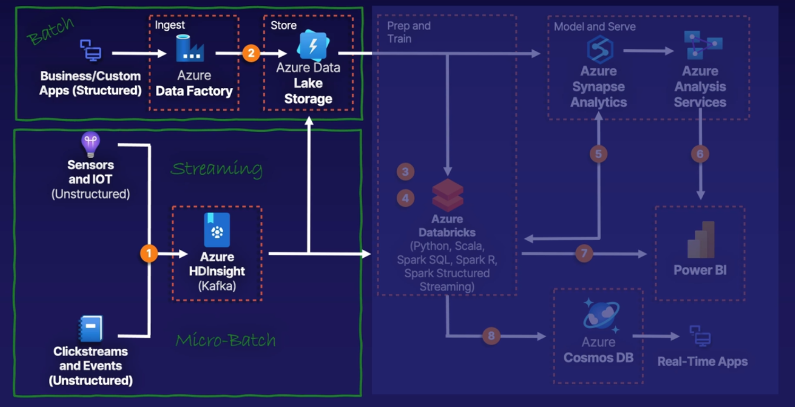

# AZ 900 Notes

## Core Data Concepts
- Transactional Data Processing
  - OLTP
  - ACID semantics
    - Atomicity
    - Consistency
    - Isolation
    - Durability
  - LOB Applications
    - Live applications that process business data - often referred to as line of business (LOB) applications.
- Analytical Data Processing
  - Analytical data processing typically uses read-only (or read-mostly) systems that store vast volumes of historical data or business metrics.
  - A common architecture for enterprise-scale analytics looks like this:
    1. Data files may be stored in a central data lake for analysis.
    2. An extract, transform, and load (ETL) process copies data from files and OLTP databases into a data warehouse that is optimized for read activity. Commonly, a data warehouse schema is based on fact tables that contain numeric values you want to analyze (for example, sales amounts), with related dimension tables that represent the entities by which you want to measure them (for example, customer or product),
    3. Data in the data warehouse may be aggregated and loaded into an online analytical processing (OLAP) model, or cube. Aggregated numeric values (measures) from fact tables are calculated for intersections of dimensions from dimension tables. For example, sales revenue might be totaled by date, customer, and product.
    4. The data in the data lake, data warehouse, and analytical model can be queried to produce reports, visualizations, and dashboards.
- The three key job roles that deal with data in most organizations are:
  1. Database administrators manage databases, assigning permissions to users, storing backup copies of data and restore data in the event of a failure.
  2. Data engineers manage infrastructure and processes for data integration across the organization, applying data cleaning routines, identifying data governance rules, and implementing pipelines to transfer and transform data between systems.
  3. Data analysts explore and analyze data to create visualizations and charts that enable organizations to make informed decisions.
- Data Services in Azure
  - Azure SQL
  - Azure Database for open-source relational databases
    - Azure Database for MySQL 
    - Azure Database for MariaDB
    - Azure Database for MariaDB
  - Azure Cosmos DB
  - Azure Storage
  - Azure Data Factory
  - Azure Synapse Analytics
  - Azure Databricks
  - Azure HDInsight
  - Azure Stream Analytics
  - Azure Data Explorer
  - Microsoft Purview
  - Microsoft Power BI
    - Power BI reports can be created by using the Power BI Desktop application, and then published and delivered through web-based reports and apps in the Power BI service, as well as in the Power BI mobile app.

## Azure Data Factory

- Data in Motion
  - Batch
    - Data Collected and processed in a large group
    - Most common data processing pattern is ETL
    - Processing when cheap/convenient (often when everyone else is asleep)
    - Dirty data can impact job success
    - Good for deep analysis and instances where you need lots of historical data
  - Streaming
    - Real-time or "micro-batch" processing with low latency (measured in milliseconds)
    - More tolerant of non-conforming data
    - Typical access only to recent data
    - Most common data processing pattern is ELT (Event driven ELT)
      - Immediately data is Extracted and Loaded
      - Transformation into another form happens in the destination datastore (sometimes immediately but not always)
  - 
- Microsoft describes "ingestion" as the initial activity of bringing the data into your organization's control, prior to applying the ETL or ELT "processing"
- ETL Tooling
  - Conventional
    - SSIS (SQL Server Integration Services)
    - Informatica
    - Pentaho
  - Unconventional
    - SSRS (SQL Server Reporting Services)
    - Custom Code -SQL and other
    - Excel
  - Azure Cloud
    - Data Factory
      - Designed and Optimized as a data integration tool
      - Standalone data processing tools such as DataBricks and HDInsight can be included in Data Factory pipelines
      - Can trigger SSIS packages (Helps Lift and Shift Migrations)
    - Logic Apps and Power Automate
      - Logic Apps is designed and optimized as an applicatio integration tool
    - Synapse Analytics
      - Pipelines
        - Data Factory packaged up in the Synapse platform
    - Power BI
      - Self-servicing data processing called data flows
- Data Processing Options
  - Azure Data Factory
    - Azure's flagship batch processing and micro-batch processing resource
  - Azure Databricks
    - Built on Apache Spark that supports data processing, machine learning and analytics via code in notebooks using SQL, R, Python, and Scala
  - Azure Synapse Analytics
    - Modern data warehouse and analytics service, based on SQL Data Warehouse, but that also includes Spark technologies and big data integration
  - Azure HDInsight
    - Open-source analytics engine used for big data processing, comparable to Azure Synapse Analytics
  - Azure Data Factory as Orchestrator
    - Use ADF to orchestrate Databricks, HDInsight, Data Lake Analytics jobs, others

## Cosmos DB
- Promises of Cosmos DB:
  - Globally distributed
  - NoSQL
  - Guaranteed single-digit millisecond response times
  - 99.999% availability (Backed by SLAs)
  - Automatic and instanct scalability
  - Multi-master global distribution
  - One-year free tier
- Use cases and interfaces
  - Internet of Things (IoT)
  - Gaming, Web, Mobile Apps
  - E-commerce
  - Social Networking
  - Operational Data
  - Event-Sourcing Scenarios
- Multi-Model Interface
  - SQL over JSON documents
  - Cassandra
  - Gremlin
  - MongoDB
  - Azure Table

## Azure Synapse Analytics

- Based on Azure Data Warehouse
- History
  - 1970s-1990s
    - Optimized Relational DBs
      - Star Schema
      - Facts and Dimensions
      - In the Microsoft world there was:  SQL Data Warehouse
  - Early 2000s
    - OLAP Data Cubes
      - MDX vs SQL Queries
      - Microsoft Analysis Services and Power Pivot
      - Oracle Essbase
  - 2010s
    - Data Lakes
      - "Democratized" access
      - Big data in native/ras format with metadata
      - Azure Data Lake
  - Now-ish
    - Modern Data Warehouse
      - Multi-model operational data and big data
      - Azure Synapse Analytics
      - Amazon Redshift, Snowflake
- Azure Data Lake Gen2
  - A form of Azure Blob Storage
  - Optimized for analytics in hierarchical folders
  - Efficient analysis over large quantities of data
  - Hadoop Distributed File System (HDFS) Compatible
- Azure Synapse Analytics
  - Comprehensive platform that combines data warehousing with big data analytics enabled through MPP (massively parallel processing)
  - PolyBase and Synapse Link
  - Synapse Pipelines and other tools via Synapse Studio

## References

- https://docs.microsoft.com/en-ca/training/browse/?products=azure&terms=DP-900
  - https://docs.microsoft.com/en-ca/training/paths/azure-data-fundamentals-explore-core-data-concepts/ (done)
  - https://docs.microsoft.com/en-ca/training/paths/azure-data-fundamentals-explore-relational-data/
  - https://docs.microsoft.com/en-ca/training/paths/azure-data-fundamentals-explore-non-relational-data/
  - https://docs.microsoft.com/en-ca/training/paths/azure-data-fundamentals-explore-data-warehouse-analytics/
  - https://docs.microsoft.com/en-ca/training/paths/create-no-code-predictive-models-azure-machine-learning/
- Specialized paths:
  - PowerBI:
    - https://learn.microsoft.com/en-ca/training/modules/introduction-power-bi/
    - https://learn.microsoft.com/en-ca/training/modules/get-data-power-bi/
    - https://learn.microsoft.com/en-ca/training/modules/get-started-with-power-bi/
    - https://learn.microsoft.com/en-ca/training/paths/create-use-analytics-reports-power-bi/
